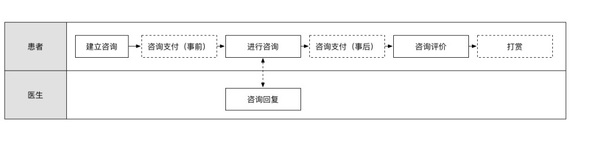

# 能力

会听:获取信息
会问:明确未确定信息,包括已有信息的补充完善\获取特定字段的新信息
专业：
# 问诊流程
## 关键词搜索
- [问诊流程](https://www.google.com/search?q=%E9%97%AE%E8%AF%8A%E6%B5%81%E7%A8%8B&newwindow=1&ei=Z3poXZH4Bprb9QO4hIrYCw&start=10&sa=N&ved=0ahUKEwjRx9-tt6nkAhWabX0KHTiCArsQ8NMDCIkB&biw=1920&bih=908)
- [AI问诊](https://www.google.com/search?q=ai+%E9%97%AE%E8%AF%8A&oq=ai+%E9%97%AE%E8%AF%8A&aqs=chrome..69i57j0.5679j0j1&sourceid=chrome&ie=UTF-8)
- 
- 
1. 患者自己填写基本信息
  提高效率
2. 身份确认
3. 明确主诉

# 最终结果

有患者签名的问诊确认单.

# 同行
- [奇点](https://www.naturali.io/)
- [curai](https://www.curai.com/)