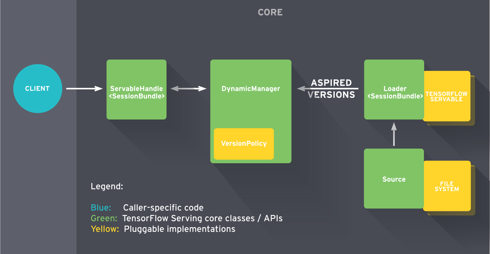

# 功能
TF Serving为ML模型提供全生命周期服务
# 组件

## Source
- 当TF Serving发现磁盘上的模型文件，该模型服务的生命周期就开始了。
- Source组件负责监控文件系统,发现模型文件，找出需要加载的新模型,并为该模型创建一个Loader。
- Loader创建完成后，Source组件将其发送至Manager，作为一个待加载的版本
## Loader
Loader需要知道模型的相关信息，包括
如何加载模型如何估算模型需要的资源，包括需要请求的RAM、GPU内存。
Loader带一个指针，连接到磁盘上存储的模型，其中包含加载模型需要的相关元数据。
不过记住，Loader现在还不允许加载模型。

## Manager
- Manager收到待加载模型版本，开始模型服务流程。
    - 模型首次推送部署，Manager先确保模型需要的资源可用，一旦获取相应的资源，Manager赋予Loader权限去加载模型。
    - 已上线模型部署一个新版本。Manager会先查询Version Policy插件，如果选(1)可用性，意味着我们倾向于确保系统对客户请求总能相应。Manager让Loader实例化新的计算图和新的权重。此时模型的两个版本被都被加载，也就是说Manager先加载新版本模型确保其可以安全服务后，然后再卸载原版本模型。如果选(2)资源，如果我们希望节省资源不为新版本模型申请额外的资源，可选择保持资源。对于重量级模型也许挺有用，模型切换间会有极短的可用性缺口，不过可以换取内存不足。
- 当用户请求模型的句柄，Manager返回句柄给Servable。
## Servable

# 导出模型
将TensorFlow构建的模型用作服务，首先需要确保导出为正确的格式
## SavedModel类
SavedModel是TensorFlow模型的一种通用序列化格式。

如果你熟悉TF，你会使用 TensorFlow Saver to persist保存模型变量。

TensorFlow Saver提供模型checkpoint磁盘文件的保存/恢复。事实上SavedModel封装了TensorFlow Saver，对于模型服务是一种**标准的导出方法**。

### 特性

1. 一个SavedModel对象中可存储一个或更多的meta-graph，这个特性允许我们为不同的任务订制不同的计算图。

    > 例如模型训练完成后，大多数情况下使用推理模式时，计算图中不需要一些用于训练的特殊操作，包括优化器、学习率调度变量、额外的预处理操作等等。
    >
    > 另外，有时候可能需要将计算图简化作移动端部署。

    在这些场景下SavedModel允许用户以不同的配置保存计算图。本例中文件中会有三个不同的计算图，分别标签为“training”, “inference”和“mobile”。这三个计算图共享同一组变量—— 意味着内存使用效率更高。

2. 不久以前，在移动设备上部署TF模型，需要为模型指定输入输出张量的名称。这个需求逼着程序员在整张计算图中寻找相应的张量。这种情况下，如果之前在计算图中变量未正确命名，这个过程就变得很繁琐了。

    SavedModel提供了SignatureDefs，简化了这一过程。SignatureDefs定义了一组TensorFlow支持的计算签名，便于在计算图中找到适合的输入输出张量。简单的说，使用这些计算签名，可以准确指定特定的输入输出节点。

    TF Serving要求模型中包含一个或多个SignatureDefs，以使用内建服务API。
    
    开始建立签名。我们需要为签名定义指定输入输出和方法名这些参数。这里输入输出表示一个从字符串到TensorInfo对象的映射(后面会详细介绍)，定义了计算图中默认接收和输出的张量。方法名 参数指向一个TF高级服务API。

    目前有3个服务API: 分类、预测和回归。每个签名定义关联一个RPC API。分类SignatureDef用于分类RPC API，预测SignatureDef用于RPC API等等。
    
    对于分类SignatureDef，需要一个输入张量(接收数据)以及可能的输出张量: 类别和/或得分。回归SignatureDef需要一个输入张量以及另一个输出张量。最后预测SignatureDef需要一个可变长度的输入输出张量。
    
    此外，SavedModel支持在操作初始化依赖于外部文件的情况下存储资产。也包括在构建SavedModel之前清空设备。
    
    我们看一下在实践中如何处理。

# 模型相关
## 创建模型
## 训练并评估模型
## 保存模型
## 检验保存文件
# 
# 
# 
# 