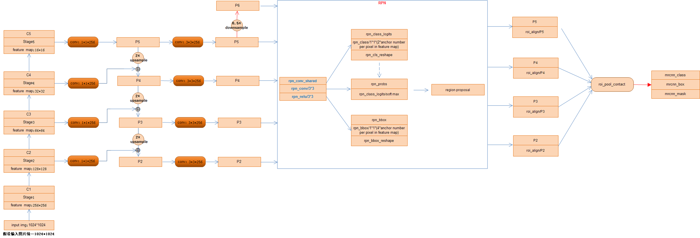

> 论文地址：https://arxiv.org/abs/1703.06870 
>
> TF复现地址：https://github.com/facebookresearch/Detectron

# 领域
计算机视觉 

# 主题
instance segmentation
区分
识别

# 相关工作

## RCNN

## Instance Segmentation

# 主要思想
## 网络架构设计理念
1. 理念简单易懂
2. 灵活
3. 通用
## 基本思路
- 扩展Faster R-CNN
- 添加一个在每一个关注区（Region of Interest (RoI)）预测分割mask的分支
- 该分支与已存在的分类分支、边框回归分支并行
# 实践

## 数据集

[MS COCO 国内下载源](http://datadownload.f3322.net:666/share/coco2014/)
 

## 模型

### 特征提取

#### resnet
特征表达能力更强
#### FPN
挖掘多尺度信息

### 生成ROI
#### 区域建议网络（RPN）

#### RoIAlign
#### Region Proposal layer
#### mask分支
FCN
像素对应
#### 损失函数
分类误差+检测误差+分割误差，即`L=Lcls+Lbox+Lmask`

 Lcls、Lbox：
 
 利用全连接预测出每个RoI的所属类别及其矩形框坐标值，可以参看FasterRCNN网络中的介绍。

 Lmask：

 ① mask分支采用FCN对每个RoI的分割输出维数为K*m*m（其中：m表示RoI Align特征图的大小），即K个类别的m*m的二值mask;保持m*m的空间布局，pixel-to-pixel操作需要保证RoI特征 映射到原图的对齐性，这也是使用RoIAlign解决对齐问题原因，减少像素级别对齐的误差。
  K \times m \times m二值mask结构解释：最终的FCN输出一个K层的mask，每一层为一类，Log输出，用0.5作为阈值进行二值化，产生背景和前景的分割Mask

这样，Lmask 使得网络能够输出每一类的 mask，且不会有不同类别 mask 间的竞争. 分类网络分支预测 object 类别标签，以选择输出 mask，对每一个ROI，如果检测得到ROI属于哪一个分 类，就只使用哪一个分支的相对熵误差作为误差值进行计算。（举例说明：分类有3类（猫，狗，人），检测得到当前ROI属于“人”这一类，那么所使用的Lmask为“人”这一分支的mask，即，每个class类别对应一个mask可以有效避免类间竞争（其他class不贡献Loss）

 ② 对每一个像素应用sigmoid，然后取RoI上所有像素的交叉熵的平均值作为Lmask。
## 效果

# 理论

